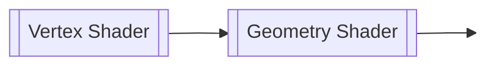
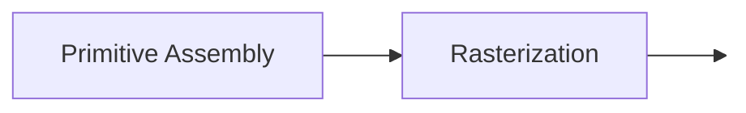
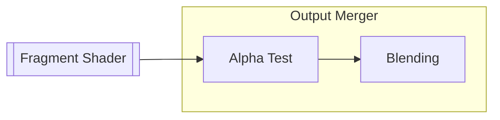
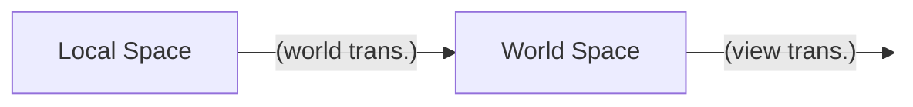

<div style="text-align: center"><h1>컴퓨터그래픽스 — 중간 정리</h1></div>

<div style="text-align: right"><p style="font-size:20px">202104340, 김재덕</p></div>

## Mathematics: Basics

**벡터**
$$
\overrightarrow{v} = \begin{bmatrix}
    x \\
    y \\
    z
\end{bmatrix}
$$
- 수학에서의 벡터는 "덧셈과 스칼라 곱, 영 벡터 (zero vector) 등이 정의되는 벡터 공간의 원소"를 뜻함
- 과학 및 공학 분야에서 ==**벡터는 변위, 속도, 가속도와 같이 "크기와 방향을 갖는 물리량"을 나타낼 때 사용**==
- 컴퓨터 그래픽스에서는 행 벡터 (row vector) 대신 열 벡터 (column vector)로도 벡터를 표현할 수 있음

**단위 벡터**
$$
|\overrightarrow{v}| = \sqrt{x^2 + y^2 + z^2} 
$$
- 벡터의 각 성분을 그 벡터의 길이로 나누는 것을 정규화 (normalization)라고 하며, 이렇게 정규화되어 길이가 1인 벡터를 단위 벡터 (unit vector)라고 함

**벡터의 내적**
$$
\overrightarrow{v} \cdot \overrightarrow{w} = 
\begin{bmatrix}
x_1 \\
y_1 \\
z_1 
\end{bmatrix}
\cdot
\begin{bmatrix}
x_2 \\
y_2 \\
z_2 
\end{bmatrix}
= x_1 \cdot x_2 + y_1 \cdot y_2 + z_1 \cdot z_2
= |\overrightarrow{v}||\overrightarrow{w}| \ cos \ \theta
$$
- ==**벡터의 내적을 이용하면 두 벡터 사이의 각도를 구할 수 있으며**==, 특히 $\overrightarrow{v}$와 $\overrightarrow{w}$가 단위 벡터라면 $\overrightarrow{v} \cdot \overrightarrow{w} = cos \ \theta$이 되어 계산이 더 편해짐
- $y = cos \ x$의 그래프를 통해 $\theta > 0$이면 두 벡터가 예각 (acute angle)을, $\theta < 0$이면 두 벡터가 둔각 (obtuse angle)을 이룰 것임을 알 수 있음

**벡터의 외적**
$$
\overrightarrow{v} \times \overrightarrow{w} = 
\begin{bmatrix}
x_1 \\
y_1 \\
z_1 
\end{bmatrix}
\times
\begin{bmatrix}
x_2 \\
y_2 \\
z_2 
\end{bmatrix} = 
\begin{bmatrix}
y_1 \cdot z_2 - z_1 \cdot y_2 \\
z_1 \cdot x_2 - x_1 \cdot z_2 \\
x_1 \cdot y_2 - y_1 \cdot x_2 
\end{bmatrix}
$$
- 벡터의 외적은 3차원 공간에서만 정의되며, ==**벡터의 외적을 이용하면 두 벡터와 수직을 이루는 또다른 벡터를 구할 수 있음**==
- **오른손 법칙 (right-hand rule):** $\overrightarrow{v}$를 오른손 검지, $\overrightarrow{w}$를 오른손 중지라고 생각하면, $\overrightarrow{v} \times \overrightarrow{w}$는 오른손 엄지 방향으로 향함
- 오른손 법칙 (또는 벡터의 외적을 직접 계산)에 의하면, $\overrightarrow{v} \times \overrightarrow{w} = -\overrightarrow{w} \times \overrightarrow{v}$

**행렬**
$$
A = \begin{bmatrix}
x_1 & x_2 \\
y_1 & y_2 \\
z_1 & z_2 
\end{bmatrix}
$$
- 1개 이상의 수식을 직사각형 형태로 배열한 것으로, ==**주로 여러 개의 벡터나 연립 일차 방정식 (system of linear equations)의 계수 등을 하나로 묶어서 표현하기 위해 사용함**==
- 행렬의 가로 줄을 행 (row), 세로 줄을 열 (column)이라고 하며, 행의 개수가 $Y$이고 열의 개수가 $X$인 행렬의 크기는 $Y \times X$와 같이 나타냄

**역행렬**
$$
AA^{-1} = A^{-1}A = I
$$
- $AA^{-1} = A^{-1}A = I$의 조건을 만족하는 $A^{-1}$가 존재하는 경우, $A$를 가역 행렬 (invertible matrix)라고 하며 $A^{-1}$를 역행렬 (inverse matrix)라고 함
- 방정식 $Ax = b$의 해가 $x = A^{-1}b$ 단 하나인 경우, $A$의 역행렬이 존재함

**전치 행렬**
$$
A^T = \begin{bmatrix}
x_1 & y_1 & z_1 \\
x_2 & y_2 & z_2 \\
\end{bmatrix}
$$
- $A$의 행과 열을 주 대각선 (main diagonal)을 기준으로 뒤집은 행렬을 전치 행렬 (transpose matrix)라고 함
- 두 벡터의 내적 $\overrightarrow{v} \cdot \overrightarrow{w}$은 ${\overrightarrow{v}}^T \ \overrightarrow{w}$로 표현할 수도 있음
- $(A + B)^T = A^T + B^T, (AB)^T = {B}^T{A}^T, (A^{-1})^T = (A^{T})^{-1}$

**행렬의 곱**
$$
A = \begin{bmatrix}
x_1 & x_2 \\
y_1 & y_2 \\
z_1 & z_2 
\end{bmatrix}, \
B = \begin{bmatrix}
x_3 & x_4 \\
y_3 & y_4 \\
\end{bmatrix}
$$
$$
AB = \begin{bmatrix}
x_1 \cdot x_3 + x_2 \cdot y_3 & x_1 \cdot x_4 + x_2 \cdot y_4 \\
y_1 \cdot x_3 + y_2 \cdot y_3 & y_1 \cdot x_4 + y_2 \cdot y_4 \\
z_1 \cdot x_3 + z_2 \cdot y_3 & z_1 \cdot x_4 + z_2 \cdot y_4  
\end{bmatrix}
$$
- $m \times n$ 크기의 행렬 $A$와 $n \times p$ 크기의 행렬 $B$의 곱은 $m \times p$의 행렬이 됨
- $m = p = 1$일 경우에 $AB$는 행 1개과 열 1개의 곱 (두 행렬의 내적)이 되지만, $BA$는 $n \times n$ 크기의 행렬이 되는 것을 확인할 수 있음 ($AB \ne BA$)

**항등 행렬**
$$
I = \begin{bmatrix}
1 & 0 & 0 & 0 \\
0 & 1 & 0 & 0 \\
0 & 0 & 1 & 0 \\
0 & 0 & 0 & 1 \\
\end{bmatrix}
$$
- 주 대각선의 모든 원소가 1이고 나머지 원소가 1인 행렬을 단위 행렬 (unit matrix) 또는 항등 행렬 (identity matrix)라고 함
- 임의의 행렬 $A$와 항등 행렬 $I$를 곱하면 그 결과는 항상 $A$가 되며 ($AI = IA = A$), ==**항등 행렬은 변환 행렬 (transformation matrix)의 가장 기초적인 형태로 볼 수 있음**==

**변환 행렬**
- 컴퓨터 그래픽스에서 3차원 벡터를 표현할 때는 $\overrightarrow{v} = \begin{bmatrix}x \\ y \\ z\end{bmatrix}$ 형태의 $3 \times 1$ 행렬이 아닌 $\overrightarrow{v} = \begin{bmatrix}x \\ y \\ z \\ w\end{bmatrix}$ 형태의 $4 \times 1$ 행렬을 이용하는데, 이렇게 $N$차원 공간에서의 좌표를 $(N + 1) \times 1$의 성분으로 표현하는 좌표계를 동차 좌표계 (homogeneous coordinates)라고 함
- ==**동차 좌표계를 사용하는 이유는 원래 두 벡터의 합으로 나타내야 하는 이동 (translation) 연산을 크기 변환 (scale)과 회전 (rotation)처럼 행렬의 곱으로 나타내기 위해서임**==

**선형 보간법**
- 시작 점 $C_0$과 끝 점 $C_1$을 잇는 선분에서 $C_0$과 $C_1$에 각각 특정한 값 $c_0$, $c_1$이 주어졌을 때, $C_0$과 $C_1$ 사이의 임의의 점에 대응되는 값을 비례식을 통해 찾는 알고리즘
- 예를 들어, $C_0$과 $C_1$ 사이에 $B$라는 점이 주어지고, $B$와 $C_1$ 사이의 거리가 $C_0$과 $B$ 사이의 거리의 $t$배라면, $B$에 대응되는 값은 $(1 - t)c_0 + tc_1$이 됨 

---

## Modeling

**렌더링 과정의 이해**
- 컴퓨터 그래픽스에서 ==**모든 물체는 3차원 공간에 존재**==하지만 (2차원 게임도 사실은 $z = 0$인 3차원 공간임), 게임을 하는 사람의 입장에서는 컴퓨터 모니터를 통해 ==**픽셀 (pixel)로 이루어진 2차원의 평평한 화면만을 볼 수 있음**==
- 따라서, 그래픽 렌더링 과정의 핵심은 **3차원 좌표를 2차원 좌표로 표현하고, 그 2차원 좌표에 색상을 입혀 픽셀로 만드는 것**이라고 할 수 있음

**그래픽 파이프라인**



- 셰이더 (shader)는 CPU가 아닌 ==**GPU에서 실행되는 프로그램을 뜻하며,**== 게임 프로그래머가 직접 작성해주어야 함
- 정점 셰이더 (vertex shader)는 3차원 공간에 존재하는 정점 좌표들을 적절하게 처리하여 다음 단계에 넘겨줌
- 래스터화 (rasterization) 단계에서는 정점으로 이루어진 도형을 게임 화면에 그릴 수 있는 '픽셀' (pixel) 단위로 변환하고, 프래그먼트 셰이더 (fragment shader)는 각 픽셀의 색상을 계산함
- ==**래스터화 단계와 출력 결과 병합 등의 과정은 NVIDIA 등의 GPU 제조사에서 만든 그래픽 드라이버가 직접 처리**==하며, 게임 프로그래머가 바꿀 수 없음

**정규화 장치 좌표계**
- 정규화 장치 좌표계 (Normalized Device Coordinates, NDC)란 $x$ 성분, $y$ 성분과 $z$ 성분이 모두 $-1.0$부터 $1.0$까지인 3차원 공간을 뜻함
- ==**정점 셰이더를 거친 모든 정점은 반드시 NDC에 속해야 게임 화면에 그려질 수 있음**==

**정점의 표현**
[](https://learnopengl.com/Getting-started/Hello-Triangle)
- 프레임버퍼 (framebuffer)는 비디오 메모리 (video memory, VRAM)와 같은 뜻으로, 그래픽 카드 (graphics card)에서 다음으로 그릴 화면의 픽셀 정보가 저장되는 곳임
- 각 정점 (vertex)을 정점 셰이더에 넘겨주기 위해서는 2개 과정이 필요함
    - 모든 정점의 좌표를 1차원의 `float` 배열 (`float []`)에 때려넣고, 그 배열을 `glBufferData()` 함수를 통해 VRAM에 저장
    - VRAM에 저장된 1차원의 `float` 배열이 VRAM의 어느 곳에 저장되어 있는지, 그리고 배열로부터 어떻게 정점 좌표를 읽을지 (정점 좌표를 `float` 몇 개로 표현할 것인지 등)를 정의
- 첫 번째 과정으로 만들어지는 공간을 VBO (Vertex Buffer Object)라고 함
    - ==**Buffer Object라는 단어의 뜻은 그냥 "VRAM에 저장되는 데이터"라고 생각하면 편함**== (예를 들면, VBO, EBO나 FBO 등)
- 두 번째 과정으로 만들어지는 공간을 VAO (Vertex Array Object)라고 함
    - VAO에는 VBO에 저장된 각 정점 좌표의 비디오 메모리 주소와 그 정점에 대한 속성이 저장됨
    - 따라서, ==**VAO를 가장 먼저 생성하고 그 다음에 VBO를 생성해**== 정점 좌표를 VRAM으로 보낸 다음, 각 정점의 속성을 지정해주어야 함
    - (그러면... VAO를 레시피, VBO를 재료, EBO는 재료 손질 순서라고 생각하면 되나...?)

**정점의 인덱스 참조**
```c
float vertices[] = { 
    /* 첫 번째 삼각형 */
     0.5f,  0.5f, 0.0f,  // #0
     0.5f, -0.5f, 0.0f,  // #1
    -0.5f,  0.5f, 0.0f,  // #2
    
    /* 두 번째 삼각형 */ 
     0.5f, -0.5f, 0.0f, // #3
    -0.5f, -0.5f, 0.0f, // #4
    -0.5f,  0.5f, 0.0f  // #5
};
```
- `vertices` 배열로 만든 VBO로 사각형을 그린다고 하면, `(#1, #3)`, `(#2, #5)`와 같이 중복되는 좌표가 존재하는 것을 알 수 있음
- 정점 좌표를 이렇게 저장하면 VRAM 공간이 낭비되기 때문에, 정점 좌표를 직접 사용하는 대신 각 좌표의 인덱스로 사각형을 표현할 방법이 필요한데, 이때 `indices`와 같이 ==**정점 좌표의 인덱스들이 저장될 VRAM 공간을 EBO (Element Buffer Object)라고 함**==
```c
float vertices[] = { 
     0.5f,  0.5f, 0.0f, 
     0.5f, -0.5f, 0.0f, 
    -0.5f, -0.5f, 0.0f, 
    -0.5f,  0.5f, 0.0f 
}; 

unsigned int indices[] = {
    /* 첫 번째 삼각형 */
    0, 1, 3,

    /* 두 번째 삼각형 */
    1, 2, 3 
};
```

**모델과 메시**
- 모델 (model)은 현실 세계의 물체를 컴퓨터로 표현한 것을 뜻하며, 메시 (mesh)라고 불리는 삼각형 또는 사각형 조각이 수백, 수천 또는 수만 개가 모여서 만들어짐
- 다각형 메시로 구성된 모델이 게임 등의 실시간 소프트웨어 (real-time applications)에 많이 사용되는 이유는 ==**GPU가 다각형 처리를 빠르게 할 수 있기 때문임**==
- 모델을 구성하는 다각형 메시의 개수 (정점 개수)가 많으면 많을수록 모델을 더 정교하게 표현 가능한데, 이것을 LOD (Level of Detail)이라고 함

**표면 법선**
$$
\overrightarrow{n}_{surface} = \frac{\overrightarrow{e_1} \times \overrightarrow{e_2}}{|\overrightarrow{e_1} \times \overrightarrow{e_2}|}
$$

- 표면 법선 (surface normal)은 삼각형 메시에서 모델의 바깥쪽을 향하는 법선 벡터를 뜻함
- 시계 반대 방향 (counter-clockwise, CCW)으로 정렬된 정점 $v_1, v_2, v_3$를 가진 삼각형의 표면 법선은 $v_1$을 지나는 두 변의 벡터 $\overrightarrow{e_1} = \overrightarrow{v_2 - v_1}$, $\overrightarrow{e_2} = \overrightarrow{v_3 - v_1}$의 외적을 통해 구할 수 있음

**정점 법선**
- 삼각형 메시 위의 어떤 ==**정점에 대한 법선 (vertex normal)은 그 정점을 가진 모든 삼각형 메시의 표면 벡터의 평균을 뜻함**==

**GLSL**
```c
#version version_number 

in type in_variable_name; 
in type in_variable_name; 

out type out_variable_name; 

uniform type uniform_name; 

void main() { 
    out_variable_name = weird_stuff_we_processed; 
}
```
- GLSL (Open**GL** **S**hading **L**anguage)는 셰이더 프로그램을 작성할 때 사용하는 프로그래밍 언어로, C언어와 비슷한 형태를 띠고 있음
- `int`, `float`, `double`과 `bool` 등의 기본 자료형 외에도 벡터와 행렬을 위한 별도의 자료형이 존재함
- 벡터와 행렬도 기본 자료형과 마찬가지로 `+`, `-`, `+=` 등의 [**산술 연산자를 통해 두 벡터의 합, 행렬의 곱 등을 계산할 수 있음**](https://en.wikibooks.org/wiki/GLSL_Programming/Vector_and_Matrix_Operations)

**GLSL의 벡터 자료형**
- 벡터는 `vec2`, `bvec3`, `ivec4`, `uvec3`, `dvec2`와 같이 2 - 4개의 요소를 정의할 때 사용하며, `b`는 `bool`, `i`는 `int`, `u`는 `unsigned int` (`uint`), `d`는 `double`을 뜻함
- 벡터의 `x`, `y,` `z`, `w` 성분에 접근할 때는 `v.x`, `v.y`, `v.z`, `v.w`를 이용함
- **스위즐링 (swizzling):** 벡터의 성분을 "뒤섞어서 (swizzle)" 또다른 벡터를 정의하는 것을 스위즐링이라고 하며, GLSL에 존재하는 고유 기능임
```c
vec2 myVec2 = vec2(1.0f, 0.5f);

// vec3 myVec3 = vec3(1.0f, 0.5f, 1.0f);
vec3 myVec3 = myVec2.xyx;

// vec4 myVec4 = vec4(1.0f, 1.0f, 0.5f, 1.0f);
vec4 myVec4 = myVec3.zxyz;

// myVec2 = vec2(0.5f, 1.0f);
myVec2.yx = vec2(1.0f, 0.5f);
```

**`in`과 `out` 한정자**
```c
layout (location = 0) in vec3 aPosition;
```
- `in`과 `out` 키워드는 셰이더의 입력 값과 출력 값을 지정하며, 셰이더 사이에 값을 넘겨줄 때도 사용할 수 있음
- 예를 들어, 정점 셰이더에서 `out vec4 vertexColor;`가 정의되어 있고 프래그먼트 셰이더에서는 `in vec4 vertexColor;`가 정의되어 있다면, OpenGL에서는 셰이더 프로그램을 링킹할 때 정점 셰이더의 `vertexColor` 값을 그대로 프래그먼트 셰이더에 넘겨줌

**`uniform` 한정자**
```c
uniform vec4 myColor;
```
- `uniform` 한정자는 모든 셰이더 프로그램에서 사용되는 "전역 변수" (global variable)을 정의할 때 사용됨
- `uniform`이 붙은 변수는 ==**셰이더 프로그램이 활성화된 상태일 경우**== `glGetUniformLocation()` 함수를 통해 그래픽 파이프라인 외부에서 직접 값을 지정해줄 수 있음

---

## Spaces and Transforms

**크기 변환 행렬 (2차원)**
$$
\begin{bmatrix}
s_x & 0 \\
0 & s_y
\end{bmatrix}
\begin{bmatrix}
x \\
y
\end{bmatrix}
=
\begin{bmatrix}
s_x \cdot x \\
x_y \cdot y
\end{bmatrix}
$$
- 크기 변환 행렬 (scaling matrix)은 다각형을 구성하는 각 좌표의 $x$성분과 $y$성분에 각각 $s_x$와 $s_y$를 곱해서 다각형의 크기를 변경함
- 크기 변환 연산에서 $s_x = s_y$인 경우를 균등 크기 변환 (uniform scaling), $s_x \ne s_y$인 경우를 비균등 크기 변환 (non-uniform scaling)이라고 함

**크기 변환 행렬 (3차원)**
$$
\begin{bmatrix}
s_x & 0 & 0 \\
0 & s_y & 0 \\
0 & 0 & s_z
\end{bmatrix}
\begin{bmatrix}
x \\
y \\
z
\end{bmatrix}
=
\begin{bmatrix}
s_x \cdot x \\
s_y \cdot y \\
s_z \cdot z
\end{bmatrix}
$$

**회전 행렬 (2차원)**
$$
\begin{bmatrix}
cos \theta & -sin \theta \\
sin \theta & cos \theta
\end{bmatrix}
\begin{bmatrix}
x \\
y
\end{bmatrix}
=
R(\theta)
\begin{bmatrix}
x \\
y
\end{bmatrix}
=
\begin{bmatrix}
x^\prime \\
y^\prime
\end{bmatrix}
$$
- $x = rcos\phi, y = rsin\phi$, 즉 $(x, y)$가 중심이 원점이고 반지름이 $r$인 원 위에 있는 경우 $x^\prime = rcos(\phi + \theta)$, $y^\prime = rsin(\phi + \theta)$가 되고, 삼각 함수의 덧셈 법칙으로 전개하면 회전 행렬 (rotation matrix) $R(\theta)$를 구할 수 있음
- $R(\theta)$는 ==**벡터를 원점 기준으로 반시계 방향으로 회전**==시키는데, $\theta$가 음수일 경우 $R(\theta)$는 벡터를 원점 기준으로 시계 방향으로 회전시킴

**회전 행렬 (3차원)**
$$
R_x(\theta) = \begin{bmatrix}
1 & 0 & 0 \\
0 & cos \theta & -sin \theta \\
0 & sin \theta & cos \theta
\end{bmatrix}
$$

$$
R_y(\theta) = \begin{bmatrix}
cos \theta & 0 & sin \theta \\
0 & 1 & 0 \\
-sin \theta & 0 & cos \theta
\end{bmatrix}
$$

$$
R_z(\theta) = \begin{bmatrix}
cos \theta & -sin \theta & 0 \\
sin \theta & cos \theta & 0 \\
0 & 0 & 1
\end{bmatrix}
$$
- 2차원에서의 회전 연산은 원점을 기준으로 점을 회전시키지만, ==**3차원에서의 회전 연산은 축 (axis)을 기준으로 점을 회전시킴**==

**이동 행렬 (2차원)**
$$
\begin{bmatrix}
x \\
y
\end{bmatrix} +
\begin{bmatrix}
d_x \\
d_y
\end{bmatrix} =
\begin{bmatrix}
x + d_x \\
y + d_y
\end{bmatrix}
$$
- ==**이동 (translation)은 크기 변환이나 회전과 달리, 행렬의 곱으로 표현할 수 없음**== $\rightarrow$ 동차 좌표계 (homogeneous coordinates) 이용!

**동차 좌표계**
$$
\begin{bmatrix}
1 & 0 & d_x \\
0 & 1 & d_y \\
0 & 0 & 1
\end{bmatrix}
\begin{bmatrix}
x \\
y \\
w
\end{bmatrix} =
\begin{bmatrix}
x + d_x \\
y + d_y \\\
w
\end{bmatrix}
$$
- $n$차원 공간의 좌표, 즉 $n$개의 성분을 가진 점을 $n + 1$의 성분을 가진 벡터로 표현하는 좌표계
- 예를 들면, 2차원 공간의 점 $(x, y)$는 성분을 하나 더 추가하여 $(wx, wy, w)$의 형태로 나타낼 수 있음
- ==**동차 좌표계를 이용하면 좌표의 이동을 행렬의 곱으로 표현 가능**==
- 동차 좌표 $(wx, wy, w)$에서 원래 좌표를 구할 때는 마지막 성분이 1이 되도록 모든 성분을 $w$로 나누면 됨 $\rightarrow$ $(\frac{x}{w}, \frac{y}{w}, 1)$

**이동 행렬 (3차원)**
$$
\begin{bmatrix}
1 & 0 & 0 & d_x \\
0 & 1 & 0 & d_y \\
0 & 0 & 1 & d_z \\
0 & 0 & 0 & 1
\end{bmatrix} 
\begin{bmatrix}
x \\
y \\
z \\
w
\end{bmatrix} =
\begin{bmatrix}
x + d_x \\
y + d_y \\
z + d_z \\
w
\end{bmatrix}
$$
- 2차원에서의 이동 연산과 마찬가지로, 동차 좌표계를 이용해 좌표의 이동을 행렬의 곱으로 표현

**변환 행렬**
- 앞에서 정리한 크기 변환, 이동 및 회전 연산을 변환 (transformation)이라고 함
- 변환은 행렬 곱으로 표현되므로 교환 법칙이 성립하지 않음
- 원점이 아닌 다른 점 $(a, b$)를 기준으로 회전 연산을 하려는 경우
    1. 점 $(x, y)$를 $(-a, -b)$만큼 이동시키고...
    2. $(x - a, y - b)$를 원점을 기준으로 회전시킨 다음...
    3. 그 점을 $(a, b)$만큼 다시 이동시키면 됨!

**아핀 변환 (2차원)**
$$
S' =
\begin{bmatrix}
s_x & 0 & 0 \\
0 & s_y & 0 \\
0 & 0 & 1
\end{bmatrix}
, \ R'(\theta) =
\begin{bmatrix}
cos \theta & -sin \theta & 0 \\
sin \theta & cos \theta & 0 \\
0 & 0 & 1
\end{bmatrix}, \
T' =
\begin{bmatrix}
1 & 0 & d_x \\
0 & 1 & d_y \\
0 & 0 & 1
\end{bmatrix}
$$
- 아핀 변환 (affine transform)은 크기 변환, 회전, 반사 (reflection) 등의 선형 변환 (linear transform) 연산, 그리고 이동 연산을 가리킴
- 아핀 변환 행렬은 몇 개가 주어지든 항상 하나의 행렬로 결합할 수 있으며, ==**아핀 변환 행렬의 마지막 행은 반드시 $\begin{bmatrix} 0 & 0 & 1\end{bmatrix}$의 형태를 가짐**==
- 마지막 행을 제외한 $2 \times 3$ 행렬은 왼쪽 $2 \times 2$ 행렬 ($L$)과 오른쪽 $2 \times 1$ 열 벡터 ($t$)를 합친 $\begin{bmatrix} L \ | \ t\end{bmatrix}$ 형태로 볼 수 있으며, 이때 $L$에는 크기 변환과 회전 연산만이 포함되고 열 벡터 $t$는 이동 연산까지 포함됨
- 어떤 점 $p$에 아핀 변환을 적용할 때는 먼저 $L$을 적용, 즉 크기 변환과 회전을 먼저 하고 그 다음에 $t$를 적용하여 최종 위치 $Lp + t$를 구할 수 있음

**아핀 변환 (3차원)**
$$
S' =
\begin{bmatrix}
s_x & 0 & 0 & 0 \\
0 & s_y & 0 & 0 \\
0 & 0 & s_z & 0 \\
0 & 0 & 0 & 1
\end{bmatrix}
, \ {R_x}'(\theta) =
\begin{bmatrix}
cos \theta & -sin \theta & 0 & 0 \\
sin \theta & cos \theta & 0 & 0 \\
0 & 0 & 1 & 0 \\
0 & 0 & 0 & 1
\end{bmatrix}, \
T' =
\begin{bmatrix}
1 & 0 & 0 & d_x \\
0 & 1 & 0 & d_y \\
0 & 0 & 1 & d_z \\
0 & 0 & 0 & 1
\end{bmatrix}
$$
- 2차원에서의 아핀 변환 행렬과 유사하게, ==**아핀 변환 행렬의 마지막 행은 반드시 $\begin{bmatrix} 0 & 0 & 1\end{bmatrix}$의 형태를 가짐**==
- 마지막 행을 제외한 $3 \times 4$ 행렬은 왼쪽 $3 \times 3$ 행렬 ($L$)과 오른쪽 $3 \times 1$ 열 벡터 ($t$)를 합친 $\begin{bmatrix} L \ | \ t\end{bmatrix}$ 형태로 볼 수 있으며, 이때 $L$에는 크기 변환과 회전 연산만이 포함되고 열 벡터 $t$는 이동 연산까지 포함됨

**강체 운동**
- 변환 행렬에 오직 회전과 이동 연산만이 포함된 경우 물체의 회전 각도와 위치만 변하고 물체의 모양은 변경하지 않으므로, 이러한 행렬을 강체 운동 (rigid-body motion) 행렬이라고도 함

**크기 및 이동 변환 행렬의 역행렬**
$$
S^{-1} =
\begin{bmatrix}
\frac{1}{s_x} & 0 & 0 & 0 \\
0 & \frac{1}{s_y} & 0 & 0 \\
0 & 0 & \frac{1}{s_z} & 0 \\
0 & 0 & 0 & 1
\end{bmatrix},
T^{-1} =
\begin{bmatrix}
1 & 0 & 0 & -d_x \\
0 & 1 & 0 & -d_y \\
0 & 0 & 1 & -d_z \\
0 & 0 & 0 & 1
\end{bmatrix}
$$
- (당연한 얘기지만) 변환 행렬의 역행렬을 물체에 적용하면 그 물체의 크기, 회전 각도와 위치가 원래대로 되돌아가게 됨 ($SS^{-1} = S^{-1}S = I$, $TT^{-1} = T^{-1}T = I$)

**회전 행렬의 역행렬**
$$
R^{-1} = R^T =
\begin{bmatrix}
u_x & u_y & u_z \\
v_x & v_y & v_z \\
n_x & n_y & n_z
\end{bmatrix}
$$
- $3 \times 3$ 회전 행렬의 열을 각각 $u, v, n$이라고 하면, $u \cdot u = v \cdot v = n \cdot n = 1$이고 $u \cdot v = v \cdot n = n \cdot u = 0$임을 알 수 있는데, 이것은 $u$, $v$, $n$이 각각 물체 공간 (object space, local space)의 $x$축, $y$축과 $z$축을 나타내는 단위 벡터임을 뜻함
- ==**회전 행렬을 통해 물체 공간의 세 축을 구할 수 있으며, 물체 공간의 세 축을 통해 회전 행렬을 구할 수 있음**==

---

## Vertex Processing

**정점 셰이더**


- 정점 셰이더에서 가장 중요한 작업은 VAO로부터 정점을 하나씩 입력받고, ==**각 정점에 적절한 행렬 연산을 수행하여 정점의 좌표가 NDC 내에 있도록 만드는 것임**==

**물체 공간**
- 중심이 원점이고 회전 축이 물체와 완전히 고정된 공간
- 내가 게임 캐릭터라면, 내가 어디에 서 있고 내 몸이 어느 방향을 향하는지에 관계없이 항상 내 몸의 중심은 $(x = 0, y = 0, z = 0)$이고 회전 축도 전부 다 나를 기준으로 $x$축, $y$축, $z$축이 결정되는 공간

**세계 공간**
- 물체 공간에 있는 물체의 각 정점 좌표에 ==**크기 변환, 회전, 이동 등이 포함된 모델 행렬 (model matrix)을 곱하여**== 게임 세계에 물체를 배치
- 내가 게임 캐릭터라면, 리스폰 장소나 튜토리얼 맵의 시작 위치 등의 게임 세계 원점을 기준으로 나의 중심과 회전 축이 결정되는 공간

**정점 법선의 변환**
- 게임 세계에 물체를 배치할 때는 ==**정점에 대한 법선도 같이 변환해주어야 함**==
- 법선 벡터는 위치에 상관없이 방향만이 중요하므로 변환 행렬의 $L$만이 법선 벡터에 영향을 주는데, ==**만약 $L$에 비균등 크기 변환이 포함된 경우 법선 벡터가 다각형과 수직을 이루지 않게 됨**== $\rightarrow$ 정점 법선에는 모델 행렬 대신 $(L^{-1})^T$를 곱해줘야 함!

**카메라 공간**
- 게임 세계 공간에 있는 물체의 각 정점 좌표에 ==**시점 행렬 (view matrix)를 곱하여**== 게임 캐릭터 또는 관찰자 시점을 기준으로 물체를 배치

**시점 변환**

- 물체를 실제 게임처럼 1인칭 또는 3인칭 시점으로 보기 위해서는 물체를 어디에서 바라보고 있는지 ($EYE$), 물체의 어느 곳을 바라보고 있는지 ($AT$)와 물체를 바라보고 있는 곳에서 위쪽이 어느 방향인지 ($UP$)를 정의해주어야 함
- 그 다음에는 카메라의 위치를 게임 세계의 원점으로 이동시키고, 모든 물체들을 카메라가 이동한 만큼 뒤로 밀어냄
- 마지막으로, 게임 세계의 모든 물체를 카메라의 위치인 원점을 기준으로 회전시켜, 게임 세계의 회전 축과 카메라의 회전 축이 일치하게 만듦 (기저 변환)

**시점 행렬**
$$
M_{view} = 
\begin{bmatrix}
u_x & u_y & u_z & 0 \\
v_x & v_y & v_z & 0 \\
n_x & n_y & n_z & 0 \\
0 & 0 & 0 & 1
\end{bmatrix} \
\begin{bmatrix}
1 & 0 & 0 & -EYE_x \\
0 & 1 & 0 & -EYE_y \\
0 & 0 & 1 & -EYE_z \\
0 & 0 & 0 & 1
\end{bmatrix} =
\begin{bmatrix}
u_x & u_y & u_z & -EYE_x \\
v_x & v_y & v_z & -EYE_y \\
n_x & n_y & n_z & -EYE_z \\
0 & 0 & 0 & 1
\end{bmatrix}
$$
- $\overrightarrow{n} = \frac{\overrightarrow{EYE} - \overrightarrow{AT}}{|\overrightarrow{EYE} - \overrightarrow{AT}|}$
- $\overrightarrow{u} = \frac{\overrightarrow{UP} \times \overrightarrow{n}}{|\overrightarrow{up} \times \overrightarrow{n}|}$
- $\overrightarrow{v} = \overrightarrow{n} \times \overrightarrow{u}$

**오른손 좌표계와 왼손 좌표계**
- 오른손 좌표계에서는 $z$축이 오른손 엄지, 즉 게임 화면의 바깥쪽을 향하고, 왼손 좌표계에서는 게임 화면의 안쪽으로 향함
- 시점 행렬과 물체의 위치가 같더라도 카메라와 물체가 속한 좌표계가 다르면 카메라 공간에서 물체가 좌우 반전되어 보일 수 있음 $\rightarrow$ 카메라와 물체의 $z$축을 반전시키면 됨!

**클립 공간**
- 카메라 공간에 있는 물체의 각 정점 좌표에 ==**투영 행렬 (projection matrix)를 곱하여**== 모든 정점 좌표를 NDC 좌표로 변환

**시야 각**
[](https://docs.tizen.org/application/native/guides/graphics/vertex-shader/)
- 카메라에 보이는 3차원 공간의 물체들을 2차원의 게임 화면에 그리기 위해서는 카메라와 가까운 물체는 크게 그리고, 카메라와 먼 물체는 작게 그리는 '원근법' (perspective)을 적용해야 함 $\rightarrow$ ==**동차 좌표의 $w$ 요소가 커질수록 물체의 크기는 작아짐!**==
- 카메라를 정의하기 위해서는 좌표 축 외에도 카메라를 확대 및 축소하기 위한 시야 각 (field-of-view, FOV)과 게임 화면의 종횡비 (aspect ratio)를 정의해야 함
- 마지막으로, 게임의 성능을 위해서는 카메라와 너무 멀리 떨어진 물체는 그리지 않는 것이 좋으므로 카메라로부터 $z$좌표가 $-n$만큼 떨어진 "가까운 평면" (near plane)과 $z$좌표가 $-f$ (단, $f > n$)만큼 떨어진 "먼 평면" (far plane)을 정의함
- 카메라 위치로부터 만들어지는 ==**사각뿔 (pyramid)을 가까운 평면과 먼 평면으로 잘라서 만들어지는 도형을 시야 절두체 (view frustum)**==라고 함

**[투영 변환](https://www.songho.ca/opengl/gl_projectionmatrix.html)**
$$
M_{proj} =
\begin{bmatrix}
\frac{cot(\frac{fov}{2})}{aspect} & 0 & 0 & 0 \\
0 & cot(\frac{fov}{2}) & 0 & 0 \\
0 & 0 & \frac{f + n}{f - n} & \frac{2nf}{f - n} \\
0 & 0 & -1 & 0
\end{bmatrix}
$$
$$
{M_{proj}}^\prime =
\begin{bmatrix}
\frac{cot(\frac{fov}{2})}{aspect} & 0 & 0 & 0 \\
0 & cot(\frac{fov}{2}) & 0 & 0 \\
0 & 0 & -\frac{f + n}{f - n} & -\frac{2nf}{f - n} \\
0 & 0 & -1 & 0
\end{bmatrix}
$$
- 절두체를 중심이 원점인 $2 \times 2 \times 2$ 크기의 정육면체로 변환 $\rightarrow$ ==**절두체의 모든 물체가 NDC에 속하게 됨**==
- 투영 변환 행렬의 마지막 행은 $\begin{bmatrix}0 & 0 & -1 & 0\end{bmatrix}$인데, $-1$은 입력 좌표의 $w$ 값을 $-z$로 변환시켜 ==**카메라와 가까운 물체는 크게, 카메라와 먼 물체는 작게 그리도록 함**==
- 래스터라이저 (rasterizer)는 하드웨어적으로 구현되어 있으며, 클립 공간이 왼손 좌표계 규칙을 따른다고 가정하기 때문에 OpenGL에서는 투영 변환이 끝난 물체들의 $z$축을 반전시켜줘야 함

---

## Rasterizer

**래스터라이저**
- 래스터라이저는 정점 셰이더의 출력 값인 클립 공간에서의 정점 좌표를 입력받고, 정점을 이어 삼각형들을 만든 다음, 각 삼각형에 속하는 모든 좌표들을 프래그먼트 (fragment)라는 형태로 변환함
- ==**프래그먼트는 정점을 픽셀 (pixel)로 나타내기 위한 정점 속성 정보를 뜻하며, 정점에 대한 법선과 텍스처 좌표 등의 정보가 포함됨**==

**물체 절단**
- 래스터라이저는 클립 공간 (절두체) 외부에 있는 물체의 일부 또는 전부를 잘라서, 절두체 외부에 있는 정점을 모두 제거함

**뒷면 제거**
[](https://docs.tizen.org/application/native/guides/graphics/assembly/)
- 뒷면 제거 (back-face culling)는 카메라를 기준으로 물체의 뒷면이 되는 부분을 그리지 않고 제거하여 렌더링 성능을 높이는 것을 뜻함
- 물체가 카메라를 바라보는 방향 ($\overrightarrow{EYE} - \overrightarrow{AT}$)과 다각형의 법선 벡터의 내적 ($(\overrightarrow{EYE} - \overrightarrow{AT}) \cdot \overrightarrow{n_i}$)이 0보다 작거나, 다각형의 정점 순서가 시계 방향 (clockwise, CW)일 경우 뒷면으로 간주함

**뷰포트**
[](https://docs.tizen.org/application/native/guides/graphics/assembly/)
- 뷰포트 (viewport)는 게임 창에서 게임 화면이 그려지는 영역을 뜻하며, 창 전체가 아닌 일부일수도 있음
- 뷰포트에 대한 화면 공간 (screen space, window space)는 왼쪽 좌표계 규칙을 따름

**뷰포트 변환**
$$
\begin{bmatrix}
\frac{w}{2} & 0 & 0 & minX + \frac{w}{2} \\
0 & \frac{h}{2} & 0 & minY + \frac{h}{2} \\
0 & 0 & \frac{maxZ - minZ}{2} & \frac{maxZ + minZ}{2} \\
0 & 0 & 0 & 1
\end{bmatrix}
$$
- NDC에 있는 모든 물체의 정점 좌표를 게임 화면 좌표로 변환

**주사 변환**
- 주사 변환 (scan conversion)은 삼각형 내부의 연속적인 좌표들을 프래그먼트라는 이산적인 단위로 변환하여, 삼각형이 픽셀로 표현될 수 있도록 함

---

## Image Texturing

**프래그먼트 셰이더**
- 프래그먼트 셰이더는 래스터라이저의 출력 값인 프래그먼트를 입력으로 받아 프래그먼트의 최종 색상을 결정하며, ==**주로 물체에 텍스처 (texturing)나 조명 효과를 적용 (lighting)하는 단계임**==

**텍스처**
[](https://docs.tizen.org/application/native/guides/graphics/texturing/)
- 프래그먼트에는 정점에 대한 법선과 텍스처 좌표 등의 정보가 포함되는데, 이 중에서 텍스처 좌표는 텍스처의 어느 부분이 정점에 그려질지를 결정함
- 텍스처 좌표는 주로 $(s, t)$또는 $(u, v)$와 같은 형태로 표현되며, 텍스처의 해상도와 관계없이 텍스처를 자유롭게 사용하기 위해 $s$와 $t$의 범위를 $[0, 1]$로 일반화 (normalize)시키는 것이 일반적임

**표면 파라미터화**
- 3차원 모델에 대한 표면 (surface)을 2차원 평면에 펼치고 ==**모델의 각 정점에 텍스처의 좌표를 지정해주는 과정을 표면 파라미터화 (surface parameterization)라고 함**==

**아틀라스**
- 사람과 같이 복잡한 형태의 모델에 대한 텍스처는 얼굴, 옷, 신발 등의 여러 부분으로 나누어져 있는데, 이것을 패치 (patch)라고 함
- 패치에 대한 텍스처를 차트 (chart)라고 하며, ==**여러 개의 차트를 하나의 큰 텍스처에 모두 저장해놓은 것을 아틀라스 (atlas)라고 함**==

**텍스처 래핑**
- 텍스처 래핑 (texture wrapping)은 텍스처를 그릴 때 $s$와 $t$의 범위가 $[0, 1]$ 바깥에 있는 경우 텍스처의 일부 또는 전체를 반복해서 그리는 방법을 뜻함

**텍스처 필터링**
[](https://docs.tizen.org/application/native/guides/graphics/texturing/)
[](https://docs.tizen.org/application/native/guides/graphics/texturing/)
- 이미지 텍스처 (image texture)는 이미지와 마찬가지로 텍셀 (pixel)을 불연속적으로 배열한 것이기 때문에, 텍스처 좌표가 텍셀의 중심이 아닌 곳의 색상은 정의할 수 없음 $\rightarrow$ 텍스처 좌표 주변에 있는 텍셀들을 합쳐 프래그먼트의 색상을 결정해야 함
- **텍스처의 확대 (magnification):** 화면 공간에 보이는 다각형의 크기가 텍스처 해상도보다 클 경우, 프래그먼트 (픽셀)의 개수가 텍셀의 개수보다 많으므로 이미지 텍스처를 확대해야 함
- **텍스처의 축소 (magnification):** 화면 공간에 보이는 다각형의 크기가 텍스처 해상도보다 작을 경우, 프래그먼트 (픽셀)의 개수가 텍셀의 개수보다 적으므로 이미지 텍스처를 축소해야 함

**텍스처 확대에 사용되는 필터링 방법**
[](https://docs.tizen.org/application/native/guides/graphics/texturing/)
- **최근접점 샘플링 (nearest point sampling):** 프래그먼트의 색상을 중심 좌표가 가장 가까운 텍셀의 색상으로 배정

[](https://docs.tizen.org/application/native/guides/graphics/texturing/)
- **이중 선형 보간법 (bilinear interpolation):** 프래그먼트 주변에 있는 4개 텍셀에 선형 보간법을 적용

**에일리어싱**
[](https://docs.tizen.org/application/native/guides/graphics/texturing/)
- ==**텍스처를 축소시킬 때는 픽셀의 개수가 텍셀의 개수보다 적은 상황이므로 텍셀의 일부만을 선택해서 픽셀에 배정**==해줘야 하는데, 위 그림과 같은 격자 무늬의 텍스처를 그리고자 할 경우에는 텍셀을 어떻게 선택하든 축소된 텍스처가 제대로 보이지 않는 상황이 발생함 $\rightarrow$ ==**이러한 문제를 에일리어싱 (aliasing)이라고 함**==
- 에일리어싱 해결을 위한 방법을 안티-에일리어싱 (anti-aliasing, AA)라고 함

**밉맵**
[](https://docs.tizen.org/application/native/guides/graphics/texturing/)
- 이미지 텍스처의 원래 해상도가 $2^L \times 2^L$ (예를 들면, $256 \times 256$, $512 \times 512$, $1024 \times 1024$...)일 때 원래 해상도의 텍스처를 레벨 0이라고 하고, 레벨 0 텍스처의 $2 \times 2$개 텍셀을 하나로 합쳐 레벨 0보다 해상도가 2배 낮은 레벨 1 텍스처를 만들고... 이런 식으로 $L + 1$개의 텍스처를 미리 만들어놓은 것을 밉맵 (mipmap)이라고 함
- 프래그먼트 1개당 $M \times M$개의 텍셀을 차지하는 경우, 레벨 $log_2{M}$의 밉맵 텍스처를 사용

**밉맵 레벨**
```c
// For `GL_TEXTURE_MAG_FILTER`, either `GL_NEAREST` or `GL_LINEAR` can be used
glTexParameteri(GL_TEXTURE_2D, GL_TEXTURE_MAG_FILTER, GL_NEAREST);

// `GL_<how to filter each level?>_MIPMAP_<which level to choose?>`
glTexParameteri(GL_TEXTURE_2D, GL_TEXTURE_MIN_FILTER, GL_LINEAR_MIPMAP_LINEAR);
```
- 만약 $log_2 {M}$이 정수가 아니라면 $log_2 M$과 가장 가까운 정수인 $\lfloor{M + 0.5}\rfloor$를 사용 (최근접 레벨)하거나, $\lfloor{M}\rfloor$과 $\lceil{M}\rceil$의 값을 선형 보간해야 함
- ==**밉맵 레벨 선택 시에 $\lfloor{M}\rfloor$과 $\lceil{M}\rceil$의 값을 선형 보간하고 각 레벨마다 이중 선형 보간법을 적용하는 방법을 삼중 선형 보간법 (trilinear interpolation)이라고 함**==

---

