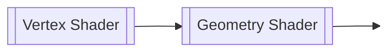
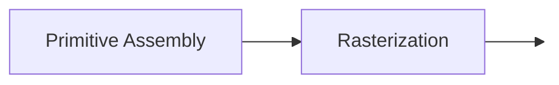
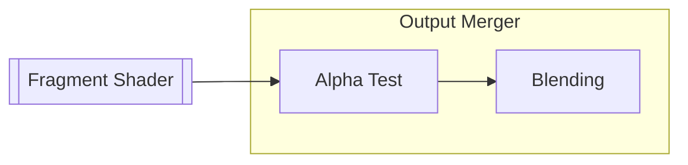

<div style="text-align: center"><h1>컴퓨터그래픽스 — 중간 정리</h1></div>

<div style="text-align: right"><p style="font-size:20px">202104340, 김재덕</p></div>

## Mathematics: Basics

### 이론 정리

**벡터**
$$
\overrightarrow{v} = \begin{bmatrix}
    x \\
    y \\
    z
\end{bmatrix}
$$
- 수학에서의 벡터는 "덧셈과 스칼라 곱, 영 벡터 (zero vector) 등이 정의되는 벡터 공간의 원소"를 뜻함
- 과학 및 공학 분야에서 ==**벡터는 변위, 속도, 가속도와 같이 "크기와 방향을 갖는 물리량"을 나타낼 때 사용**==
- 컴퓨터 그래픽스에서는 행 벡터 (row vector) 대신 열 벡터 (column vector)로도 벡터를 표현할 수 있음

**단위 벡터**
$$
|\overrightarrow{v}| = \sqrt{x^2 + y^2 + z^2} 
$$
- 벡터의 각 성분을 그 벡터의 길이로 나누는 것을 정규화 (normalization)라고 하며, 이렇게 정규화되어 길이가 1인 벡터를 단위 벡터 (unit vector)라고 함

**벡터의 내적**
$$
\overrightarrow{v} \cdot \overrightarrow{w} = 
\begin{bmatrix}
x_1 \\
y_1 \\
z_1 
\end{bmatrix}
\cdot
\begin{bmatrix}
x_2 \\
y_2 \\
z_2 
\end{bmatrix}
= x_1 \cdot x_2 + y_1 \cdot y_2 + z_1 \cdot z_2
= |\overrightarrow{v}||\overrightarrow{w}| \ cos \ \theta
$$
- ==**벡터의 내적을 이용하면 두 벡터 사이의 각도를 구할 수 있으며**==, 특히 $\overrightarrow{v}$와 $\overrightarrow{w}$가 단위 벡터라면 $\overrightarrow{v} \cdot \overrightarrow{w} = cos \ \theta$이 되어 계산이 더 편해짐
- $y = cos \ x$의 그래프를 통해 $\theta > 0$이면 두 벡터가 예각 (acute angle)을, $\theta < 0$이면 두 벡터가 둔각 (obtuse angle)을 이룰 것임을 알 수 있음

**벡터의 외적**
$$
\overrightarrow{v} \times \overrightarrow{w} = 
\begin{bmatrix}
x_1 \\
y_1 \\
z_1 
\end{bmatrix}
\times
\begin{bmatrix}
x_2 \\
y_2 \\
z_2 
\end{bmatrix} = 
\begin{bmatrix}
y_1 \cdot z_2 - z_1 \cdot y_2 \\
z_1 \cdot x_2 - x_1 \cdot z_2 \\
x_1 \cdot y_2 - y_1 \cdot x_2 
\end{bmatrix}
$$
- 벡터의 외적은 3차원 공간에서만 정의되며, ==**벡터의 외적을 이용하면 두 벡터와 수직을 이루는 또다른 벡터를 구할 수 있음**==
- **오른손 법칙 (right-hand rule):** $\overrightarrow{v}$를 오른손 검지, $\overrightarrow{w}$를 오른손 중지라고 생각하면, $\overrightarrow{v} \times \overrightarrow{w}$는 오른손 엄지 방향으로 향함
- 오른손 법칙 (또는 벡터의 외적을 직접 계산)에 의하면, $\overrightarrow{v} \times \overrightarrow{w} = -\overrightarrow{w} \times \overrightarrow{v}$

**행렬**
$$
A = \begin{bmatrix}
x_1 & x_2 \\
y_1 & y_2 \\
z_1 & z_2 
\end{bmatrix}
$$
- 1개 이상의 수식을 직사각형 형태로 배열한 것으로, ==**주로 여러 개의 벡터나 연립 일차 방정식 (system of linear equations)의 계수 등을 하나로 묶어서 표현하기 위해 사용함**==
- 행렬의 가로 줄을 행 (row), 세로 줄을 열 (column)이라고 하며, 행의 개수가 $Y$이고 열의 개수가 $X$인 행렬의 크기는 $Y \times X$와 같이 나타냄

**역행렬**
$$
AA^{-1} = A^{-1}A = I
$$
- $AA^{-1} = A^{-1}A = I$의 조건을 만족하는 $A^{-1}$가 존재하는 경우, $A$를 가역 행렬 (invertible matrix)라고 하며 $A^{-1}$를 역행렬 (inverse matrix)라고 함
- 방정식 $Ax = b$의 해가 $x = A^{-1}b$ 단 하나인 경우, $A$의 역행렬이 존재함

**전치 행렬**
$$
A^T = \begin{bmatrix}
x_1 & y_1 & z_1 \\
x_2 & y_2 & z_2 \\
\end{bmatrix}
$$
- $A$의 행과 열을 주 대각선 (main diagonal)을 기준으로 뒤집은 행렬을 전치 행렬 (transpose matrix)라고 함
- 두 벡터의 내적 $\overrightarrow{v} \cdot \overrightarrow{w}$은 ${\overrightarrow{v}}^T \ \overrightarrow{w}$로 표현할 수도 있음
- $(A + B)^T = A^T + B^T, (AB)^T = {B}^T{A}^T, (A^{-1})^T = (A^{T})^{-1}$

**행렬의 곱**
$$
A = \begin{bmatrix}
x_1 & x_2 \\
y_1 & y_2 \\
z_1 & z_2 
\end{bmatrix}, \
B = \begin{bmatrix}
x_3 & x_4 \\
y_3 & y_4 \\
\end{bmatrix}
$$
$$
AB = \begin{bmatrix}
x_1 \cdot x_3 + x_2 \cdot y_3 & x_1 \cdot x_4 + x_2 \cdot y_4 \\
y_1 \cdot x_3 + y_2 \cdot y_3 & y_1 \cdot x_4 + y_2 \cdot y_4 \\
z_1 \cdot x_3 + z_2 \cdot y_3 & z_1 \cdot x_4 + z_2 \cdot y_4  
\end{bmatrix}
$$
- $m \times n$ 크기의 행렬 $A$와 $n \times p$ 크기의 행렬 $B$의 곱은 $m \times p$의 행렬이 됨
- $m = p = 1$일 경우에 $AB$는 행 1개과 열 1개의 곱 (두 행렬의 내적)이 되지만, $BA$는 $n \times n$ 크기의 행렬이 되는 것을 확인할 수 있음 ($AB \ne BA$)

**항등 행렬**
$$
I = \begin{bmatrix}
1 & 0 & 0 & 0 \\
0 & 1 & 0 & 0 \\
0 & 0 & 1 & 0 \\
0 & 0 & 0 & 1 \\
\end{bmatrix}
$$
- 주 대각선의 모든 원소가 1이고 나머지 원소가 1인 행렬을 단위 행렬 (unit matrix) 또는 항등 행렬 (identity matrix)라고 함
- 임의의 행렬 $A$와 항등 행렬 $I$를 곱하면 그 결과는 항상 $A$가 되며 ($AI = IA = A$), ==**항등 행렬은 변환 행렬 (transformation matrix)의 가장 기초적인 형태로 볼 수 있음**==

**변환 행렬**
- 컴퓨터 그래픽스에서 3차원 벡터를 표현할 때는 $\overrightarrow{v} = \begin{bmatrix}x \\ y \\ z\end{bmatrix}$ 형태의 $3 \times 1$ 행렬이 아닌 $\overrightarrow{v} = \begin{bmatrix}x \\ y \\ z \\ w\end{bmatrix}$ 형태의 $4 \times 1$ 행렬을 이용하는데, 이렇게 $N$차원 공간에서의 좌표를 $(N + 1) \times 1$의 성분으로 표현하는 좌표계를 동차 좌표계 (homogeneous coordinates)라고 함
- ==**동차 좌표계를 사용하는 이유는 원래 두 벡터의 합으로 나타내야 하는 이동 (translation) 연산을 크기 조절 (scale)과 회전 (rotation)처럼 행렬의 곱으로 나타내기 위해서임**==

**선형 보간법**
- 시작 점 $C_0$과 끝 점 $C_1$을 잇는 선분에서 $C_0$과 $C_1$에 각각 특정한 값 $c_0$, $c_1$이 주어졌을 때, $C_0$과 $C_1$ 사이의 임의의 점에 대응되는 값을 비례식을 통해 찾는 알고리즘
- 예를 들어, $C_0$과 $C_1$ 사이에 $B$라는 점이 주어지고, $B$와 $C_1$ 사이의 거리가 $C_0$과 $B$ 사이의 거리의 $t$배라면, $B$에 대응되는 값은 $(1 - t)c_0 + tc_1$이 됨 

### 연습 문제

TODO: ...

---

## Modeling

**렌더링 과정의 이해**
- 컴퓨터 그래픽스에서 ==**모든 물체는 3차원 공간에 존재**==하지만 (2차원 게임도 사실은 $z = 0$인 3차원 공간임), 게임을 하는 사람의 입장에서는 컴퓨터 모니터를 통해 ==**픽셀 (pixel)로 이루어진 2차원의 평평한 화면만을 볼 수 있음**==
- 따라서, 그래픽 렌더링 과정의 핵심은 **3차원 좌표를 2차원 좌표로 표현하고, 그 2차원 좌표에 색상을 입혀 픽셀로 만드는 것**이라고 할 수 있음

**그래픽 파이프라인**



- 셰이더 (shader)는 CPU가 아닌 ==**GPU에서 실행되는 프로그램을 뜻하며,**== 게임 프로그래머가 직접 작성해주어야 함
- ==**래스터화 단계와 출력 결과 병합 등의 과정은 NVIDIA 등의 GPU 제조사에서 만든 그래픽 드라이버가 직접 처리**==하며, 게임 프로그래머가 바꿀 수 없음

**정규화 장치 좌표계**
- 정규화 장치 좌표계 (Normalized Device Coordinates, NDC)란 $x$ 성분, $y$ 성분과 $z$ 성분이 모두 $-1.0$부터 $1.0$까지인 3차원 공간을 뜻함
- ==**정점 셰이더를 거친 모든 정점은 반드시 NDC에 속해야 게임 화면에 그려질 수 있음**==

**정점의 표현**
- 각 정점 (vertex)을 정점 셰이더에 넘겨주기 위해서는 2개 과정이 필요함
    - 모든 정점의 좌표를 1차원의 `float` 배열 (`float []`)에 때려넣고, 그 배열을 `glBufferData()` 함수를 통해 그래픽 카드의 메모리 공간 (video memory, VRAM)에 저장
    - VRAM에 저장된 1차원의 `float` 배열로부터 어떻게 정점 좌표를 읽을지 (정점 좌표를 `float` 몇 개로 표현할 것인지 등)를 정의
- 첫 번째 과정으로 만들어지는 비디오 메모리 공간을 VBO (Vertex Buffer Object)라고 함
    - ==**Buffer Object라는 단어의 뜻은 그냥 "VRAM에 저장되는 배열"이라고 생각하면 편함**== (예를 들면, VBO, EBO나 FBO 등)
- 두 번째 과정으로 만들어지는 비디오 메모리 공간을 VAO (Vertex Array Object)라고 함

**정점의 인덱스 참조**
```c
float vertices[] = { 
    /* 첫 번째 삼각형 */
     0.5f,  0.5f, 0.0f,  // #0
     0.5f, -0.5f, 0.0f,  // #1
    -0.5f,  0.5f, 0.0f,  // #2
    
    /* 두 번째 삼각형 */ 
     0.5f, -0.5f, 0.0f, // #3
    -0.5f, -0.5f, 0.0f, // #4
    -0.5f,  0.5f, 0.0f  // #5
};
```
- `vertices` 배열로 만든 VBO로 사각형을 그린다고 하면, `(#1, #3)`, `(#2, #5)`와 같이 중복되는 좌표가 존재하는 것을 알 수 있음
- 정점 좌표를 이렇게 저장하면 VRAM 공간이 낭비되기 때문에, 정점 좌표가 아닌 그 좌표의 인덱스로 사각형을 표현할 방법이 필요한데, 이때 `indices`와 같이 ==**정점 좌표의 인덱스들이 저장될 VRAM 공간을 EBO (Element Buffer Object)라고 함**==
```c
float vertices[] = { 
     0.5f,  0.5f, 0.0f, 
     0.5f, -0.5f, 0.0f, 
    -0.5f, -0.5f, 0.0f, 
    -0.5f,  0.5f, 0.0f 
}; 

unsigned int indices[] = {
    /* 첫 번째 삼각형 */
    0, 1, 3,

    /* 두 번째 삼각형 */
    1, 2, 3 
};
```


---

## Spaces and Transforms

---

## Vertex Processing

---

