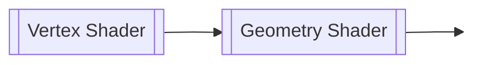
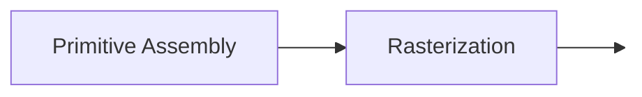
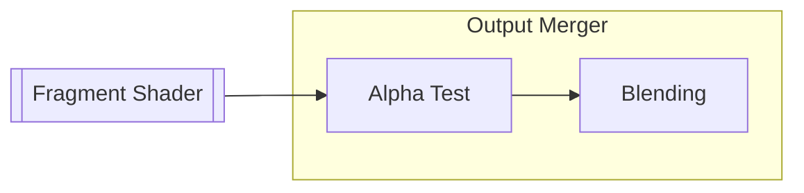
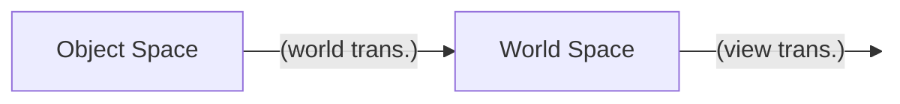

<div style="text-align: center"><h1>컴퓨터그래픽스 — 중간 정리</h1></div>

<div style="text-align: right"><p style="font-size:20px">202104340, 김재덕</p></div>

## Mathematics: Basics

### 이론 정리

**벡터**
$$
\overrightarrow{v} = \begin{bmatrix}
    x \\
    y \\
    z
\end{bmatrix}
$$
- 수학에서의 벡터는 "덧셈과 스칼라 곱, 영 벡터 (zero vector) 등이 정의되는 벡터 공간의 원소"를 뜻함
- 과학 및 공학 분야에서 ==**벡터는 변위, 속도, 가속도와 같이 "크기와 방향을 갖는 물리량"을 나타낼 때 사용**==
- 컴퓨터 그래픽스에서는 행 벡터 (row vector) 대신 열 벡터 (column vector)로도 벡터를 표현할 수 있음

**단위 벡터**
$$
|\overrightarrow{v}| = \sqrt{x^2 + y^2 + z^2} 
$$
- 벡터의 각 성분을 그 벡터의 길이로 나누는 것을 정규화 (normalization)라고 하며, 이렇게 정규화되어 길이가 1인 벡터를 단위 벡터 (unit vector)라고 함

**벡터의 내적**
$$
\overrightarrow{v} \cdot \overrightarrow{w} = 
\begin{bmatrix}
x_1 \\
y_1 \\
z_1 
\end{bmatrix}
\cdot
\begin{bmatrix}
x_2 \\
y_2 \\
z_2 
\end{bmatrix}
= x_1 \cdot x_2 + y_1 \cdot y_2 + z_1 \cdot z_2
= |\overrightarrow{v}||\overrightarrow{w}| \ cos \ \theta
$$
- ==**벡터의 내적을 이용하면 두 벡터 사이의 각도를 구할 수 있으며**==, 특히 $\overrightarrow{v}$와 $\overrightarrow{w}$가 단위 벡터라면 $\overrightarrow{v} \cdot \overrightarrow{w} = cos \ \theta$이 되어 계산이 더 편해짐
- $y = cos \ x$의 그래프를 통해 $\theta > 0$이면 두 벡터가 예각 (acute angle)을, $\theta < 0$이면 두 벡터가 둔각 (obtuse angle)을 이룰 것임을 알 수 있음

**벡터의 외적**
$$
\overrightarrow{v} \times \overrightarrow{w} = 
\begin{bmatrix}
x_1 \\
y_1 \\
z_1 
\end{bmatrix}
\times
\begin{bmatrix}
x_2 \\
y_2 \\
z_2 
\end{bmatrix} = 
\begin{bmatrix}
y_1 \cdot z_2 - z_1 \cdot y_2 \\
z_1 \cdot x_2 - x_1 \cdot z_2 \\
x_1 \cdot y_2 - y_1 \cdot x_2 
\end{bmatrix}
$$
- 벡터의 외적은 3차원 공간에서만 정의되며, ==**벡터의 외적을 이용하면 두 벡터와 수직을 이루는 또다른 벡터를 구할 수 있음**==
- **오른손 법칙 (right-hand rule):** $\overrightarrow{v}$를 오른손 검지, $\overrightarrow{w}$를 오른손 중지라고 생각하면, $\overrightarrow{v} \times \overrightarrow{w}$는 오른손 엄지 방향으로 향함
- 오른손 법칙 (또는 벡터의 외적을 직접 계산)에 의하면, $\overrightarrow{v} \times \overrightarrow{w} = -\overrightarrow{w} \times \overrightarrow{v}$

**행렬**
$$
A = \begin{bmatrix}
x_1 & x_2 \\
y_1 & y_2 \\
z_1 & z_2 
\end{bmatrix}
$$
- 1개 이상의 수식을 직사각형 형태로 배열한 것으로, ==**주로 여러 개의 벡터나 연립 일차 방정식 (system of linear equations)의 계수 등을 하나로 묶어서 표현하기 위해 사용함**==
- 행렬의 가로 줄을 행 (row), 세로 줄을 열 (column)이라고 하며, 행의 개수가 $Y$이고 열의 개수가 $X$인 행렬의 크기는 $Y \times X$와 같이 나타냄

**역행렬**
$$
AA^{-1} = A^{-1}A = I
$$
- $AA^{-1} = A^{-1}A = I$의 조건을 만족하는 $A^{-1}$가 존재하는 경우, $A$를 가역 행렬 (invertible matrix)라고 하며 $A^{-1}$를 역행렬 (inverse matrix)라고 함
- 방정식 $Ax = b$의 해가 $x = A^{-1}b$ 단 하나인 경우, $A$의 역행렬이 존재함

**전치 행렬**
$$
A^T = \begin{bmatrix}
x_1 & y_1 & z_1 \\
x_2 & y_2 & z_2 \\
\end{bmatrix}
$$
- $A$의 행과 열을 주 대각선 (main diagonal)을 기준으로 뒤집은 행렬을 전치 행렬 (transpose matrix)라고 함
- 두 벡터의 내적 $\overrightarrow{v} \cdot \overrightarrow{w}$은 ${\overrightarrow{v}}^T \ \overrightarrow{w}$로 표현할 수도 있음
- $(A + B)^T = A^T + B^T, (AB)^T = {B}^T{A}^T, (A^{-1})^T = (A^{T})^{-1}$

**행렬의 곱**
$$
A = \begin{bmatrix}
x_1 & x_2 \\
y_1 & y_2 \\
z_1 & z_2 
\end{bmatrix}, \
B = \begin{bmatrix}
x_3 & x_4 \\
y_3 & y_4 \\
\end{bmatrix}
$$
$$
AB = \begin{bmatrix}
x_1 \cdot x_3 + x_2 \cdot y_3 & x_1 \cdot x_4 + x_2 \cdot y_4 \\
y_1 \cdot x_3 + y_2 \cdot y_3 & y_1 \cdot x_4 + y_2 \cdot y_4 \\
z_1 \cdot x_3 + z_2 \cdot y_3 & z_1 \cdot x_4 + z_2 \cdot y_4  
\end{bmatrix}
$$
- $m \times n$ 크기의 행렬 $A$와 $n \times p$ 크기의 행렬 $B$의 곱은 $m \times p$의 행렬이 됨
- $m = p = 1$일 경우에 $AB$는 행 1개과 열 1개의 곱 (두 행렬의 내적)이 되지만, $BA$는 $n \times n$ 크기의 행렬이 되는 것을 확인할 수 있음 ($AB \ne BA$)

**항등 행렬**
$$
I = \begin{bmatrix}
1 & 0 & 0 & 0 \\
0 & 1 & 0 & 0 \\
0 & 0 & 1 & 0 \\
0 & 0 & 0 & 1 \\
\end{bmatrix}
$$
- 주 대각선의 모든 원소가 1이고 나머지 원소가 1인 행렬을 단위 행렬 (unit matrix) 또는 항등 행렬 (identity matrix)라고 함
- 임의의 행렬 $A$와 항등 행렬 $I$를 곱하면 그 결과는 항상 $A$가 되며 ($AI = IA = A$), ==**항등 행렬은 변환 행렬 (transformation matrix)의 가장 기초적인 형태로 볼 수 있음**==

**변환 행렬**
- 컴퓨터 그래픽스에서 3차원 벡터를 표현할 때는 $\overrightarrow{v} = \begin{bmatrix}x \\ y \\ z\end{bmatrix}$ 형태의 $3 \times 1$ 행렬이 아닌 $\overrightarrow{v} = \begin{bmatrix}x \\ y \\ z \\ w\end{bmatrix}$ 형태의 $4 \times 1$ 행렬을 이용하는데, 이렇게 $N$차원 공간에서의 좌표를 $(N + 1) \times 1$의 성분으로 표현하는 좌표계를 동차 좌표계 (homogeneous coordinates)라고 함
- ==**동차 좌표계를 사용하는 이유는 원래 두 벡터의 합으로 나타내야 하는 이동 (translation) 연산을 크기 조절 (scale)과 회전 (rotation)처럼 행렬의 곱으로 나타내기 위해서임**==

**선형 보간법**
- 시작 점 $C_0$과 끝 점 $C_1$을 잇는 선분에서 $C_0$과 $C_1$에 각각 특정한 값 $c_0$, $c_1$이 주어졌을 때, $C_0$과 $C_1$ 사이의 임의의 점에 대응되는 값을 비례식을 통해 찾는 알고리즘
- 예를 들어, $C_0$과 $C_1$ 사이에 $B$라는 점이 주어지고, $B$와 $C_1$ 사이의 거리가 $C_0$과 $B$ 사이의 거리의 $t$배라면, $B$에 대응되는 값은 $(1 - t)c_0 + tc_1$이 됨 

### 연습 문제

TODO: ...

---

## Modeling

### 이론 정리

**렌더링 과정의 이해**
- 컴퓨터 그래픽스에서 ==**모든 물체는 3차원 공간에 존재**==하지만 (2차원 게임도 사실은 $z = 0$인 3차원 공간임), 게임을 하는 사람의 입장에서는 컴퓨터 모니터를 통해 ==**픽셀 (pixel)로 이루어진 2차원의 평평한 화면만을 볼 수 있음**==
- 따라서, 그래픽 렌더링 과정의 핵심은 **3차원 좌표를 2차원 좌표로 표현하고, 그 2차원 좌표에 색상을 입혀 픽셀로 만드는 것**이라고 할 수 있음

**그래픽 파이프라인**



- 셰이더 (shader)는 CPU가 아닌 ==**GPU에서 실행되는 프로그램을 뜻하며,**== 게임 프로그래머가 직접 작성해주어야 함
- 정점 셰이더 (vertex shader)는 3차원 공간에 존재하는 정점 좌표들을 적절하게 처리하여 다음 단계에 넘겨줌
- 래스터화 (rasterization) 단계에서는 정점으로 이루어진 도형을 게임 화면에 그릴 수 있는 '픽셀' (pixel) 단위로 변환하고, 프래그먼트 셰이더 (fragment shader)는 각 픽셀의 색상을 계산함
- ==**래스터화 단계와 출력 결과 병합 등의 과정은 NVIDIA 등의 GPU 제조사에서 만든 그래픽 드라이버가 직접 처리**==하며, 게임 프로그래머가 바꿀 수 없음

**정규화 장치 좌표계**
- 정규화 장치 좌표계 (Normalized Device Coordinates, NDC)란 $x$ 성분, $y$ 성분과 $z$ 성분이 모두 $-1.0$부터 $1.0$까지인 3차원 공간을 뜻함
- ==**정점 셰이더를 거친 모든 정점은 반드시 NDC에 속해야 게임 화면에 그려질 수 있음**==

**정점의 표현**
[](https://learnopengl.com/Getting-started/Hello-Triangle)
- 프레임버퍼 (framebuffer)는 비디오 메모리 (video memory, VRAM)와 같은 뜻으로, 그래픽 카드 (graphics card)에서 다음으로 그릴 화면의 픽셀 정보가 저장되는 곳임
- 각 정점 (vertex)을 정점 셰이더에 넘겨주기 위해서는 2개 과정이 필요함
    - 모든 정점의 좌표를 1차원의 `float` 배열 (`float []`)에 때려넣고, 그 배열을 `glBufferData()` 함수를 통해 VRAM에 저장
    - VRAM에 저장된 1차원의 `float` 배열이 VRAM의 어느 곳에 저장되어 있는지, 그리고 배열로부터 어떻게 정점 좌표를 읽을지 (정점 좌표를 `float` 몇 개로 표현할 것인지 등)를 정의
- 첫 번째 과정으로 만들어지는 공간을 VBO (Vertex Buffer Object)라고 함
    - ==**Buffer Object라는 단어의 뜻은 그냥 "VRAM에 저장되는 데이터"라고 생각하면 편함**== (예를 들면, VBO, EBO나 FBO 등)
- 두 번째 과정으로 만들어지는 공간을 VAO (Vertex Array Object)라고 함
    - VAO에는 VBO에 저장된 각 정점 좌표의 비디오 메모리 주소와 그 정점에 대한 속성이 저장됨
    - 따라서, ==**VAO를 가장 먼저 생성하고 그 다음에 VBO를 생성해**== 정점 좌표를 VRAM으로 보낸 다음, 각 정점의 속성을 지정해주어야 함
    - (그러면... VAO를 레시피, VBO를 재료라고 생각하면 되나...?)

**정점의 인덱스 참조**
```c
float vertices[] = { 
    /* 첫 번째 삼각형 */
     0.5f,  0.5f, 0.0f,  // #0
     0.5f, -0.5f, 0.0f,  // #1
    -0.5f,  0.5f, 0.0f,  // #2
    
    /* 두 번째 삼각형 */ 
     0.5f, -0.5f, 0.0f, // #3
    -0.5f, -0.5f, 0.0f, // #4
    -0.5f,  0.5f, 0.0f  // #5
};
```
- `vertices` 배열로 만든 VBO로 사각형을 그린다고 하면, `(#1, #3)`, `(#2, #5)`와 같이 중복되는 좌표가 존재하는 것을 알 수 있음
- 정점 좌표를 이렇게 저장하면 VRAM 공간이 낭비되기 때문에, 정점 좌표를 직접 사용하는 대신 각 좌표의 인덱스로 사각형을 표현할 방법이 필요한데, 이때 `indices`와 같이 ==**정점 좌표의 인덱스들이 저장될 VRAM 공간을 EBO (Element Buffer Object)라고 함**==
```c
float vertices[] = { 
     0.5f,  0.5f, 0.0f, 
     0.5f, -0.5f, 0.0f, 
    -0.5f, -0.5f, 0.0f, 
    -0.5f,  0.5f, 0.0f 
}; 

unsigned int indices[] = {
    /* 첫 번째 삼각형 */
    0, 1, 3,

    /* 두 번째 삼각형 */
    1, 2, 3 
};
```

**모델과 메시**
- 모델 (model)은 현실 세계의 물체를 컴퓨터로 표현한 것을 뜻하며, 메시 (mesh)라고 불리는 삼각형 또는 사각형 조각이 수백, 수천 또는 수만 개가 모여서 만들어짐
- 다각형 메시로 구성된 모델이 게임 등의 실시간 소프트웨어 (real-time applications)에 많이 사용되는 이유는 ==**GPU가 다각형 처리를 빠르게 할 수 있기 때문임**==
- 모델을 구성하는 다각형 메시의 개수 (정점 개수)가 많으면 많을수록 모델을 더 정교하게 표현 가능한데, 이것을 LOD (Level of Detail)이라고 함

**표면 법선**
$$
\overrightarrow{n}_{surface} = \frac{\overrightarrow{e_1} \times \overrightarrow{e_2}}{|\overrightarrow{e_1} \times \overrightarrow{e_2}|}
$$

- 표면 법선 (surface normal)은 삼각형 메시에서 모델의 바깥쪽을 향하는 법선 벡터를 뜻함
- 시계 반대 방향 (counter-clockwise, CCW)으로 정렬된 정점 $v_1, v_2, v_3$를 가진 삼각형의 표면 법선은 $v_1$을 지나는 두 변의 벡터 $\overrightarrow{e_1} = \overrightarrow{v_2 - v_1}$, $\overrightarrow{e_2} = \overrightarrow{v_3 - v_1}$의 외적을 통해 구할 수 있음

**정점에 대한 법선**
- 삼각형 메시 위의 어떤 ==**정점에 대한 법선 (vertex normal)은 그 정점을 가진 모든 삼각형 메시의 표면 벡터의 평균을 뜻함**==

**GLSL**
```c
#version version_number 

in type in_variable_name; 
in type in_variable_name; 

out type out_variable_name; 

uniform type uniform_name; 

void main() { 
    out_variable_name = weird_stuff_we_processed; 
}
```
- GLSL (Open**GL** **S**hading **L**anguage)는 셰이더 프로그램을 작성할 때 사용하는 프로그래밍 언어로, C언어와 비슷한 형태를 띠고 있음
- `int`, `float`, `double`과 `bool` 등의 기본 자료형 외에도 벡터와 행렬을 위한 별도의 자료형이 존재함
- 벡터와 행렬도 기본 자료형과 마찬가지로 `+`, `-`, `+=` 등의 [**산술 연산자를 통해 두 벡터의 합, 행렬의 곱 등을 계산할 수 있음**](https://en.wikibooks.org/wiki/GLSL_Programming/Vector_and_Matrix_Operations)

**GLSL의 벡터 자료형**
- 벡터는 `vec2`, `bvec3`, `ivec4`, `uvec3`, `dvec2`와 같이 2 - 4개의 요소를 정의할 때 사용하며, `b`는 `bool`, `i`는 `int`, `u`는 `unsigned int` (`uint`), `d`는 `double`을 뜻함
- 벡터의 `x`, `y,` `z`, `w` 성분에 접근할 때는 `v.x`, `v.y`, `v.z`, `v.w`를 이용함
- **스위즐링 (swizzling):** 어떤 벡터를 다른 자료형의 벡터로 변환하고자 할 때는 다음과 같이 벡터의 성분을 "뒤섞어서 (swizzle)" 정의할 수 있음
```c
vec2 myVec2 = vec2(1.0f, 0.5f);

// vec3 myVec3 = vec3(1.0f, 0.5f, 1.0f);
vec3 myVec3 = myVec2.xyx;

// vec4 myVec4 = vec4(1.0f, 1.0f, 0.5f, 1.0f);
vec4 myVec4 = myVec3.zxyz;

// myVec2 = vec2(0.5f, 1.0f);
myVec2.yx = vec2(1.0f, 0.5f);
```

**`in`과 `out` 한정자**
```c
layout (location = 0) in vec3 aPosition;
```
- `in`과 `out` 키워드는 셰이더의 입력 값과 출력 값을 지정하며, 셰이더 사이에 값을 넘겨줄 때도 사용할 수 있음
- 예를 들어, 정점 셰이더에서 `out vec4 vertexColor;`가 정의되어 있고 프래그먼트 셰이더에서는 `in vec4 vertexColor;`가 정의되어 있다면, OpenGL에서는 셰이더 프로그램을 링킹할 때 정점 셰이더의 `vertexColor` 값을 그대로 프래그먼트 셰이더에 넘겨줌

**`uniform` 한정자**
```c
uniform vec4 myColor;
```
- `uniform` 한정자는 모든 셰이더 프로그램에서 사용되는 "전역 변수" (global variable)을 정의할 때 사용됨
- `uniform`이 붙은 변수는 ==**셰이더 프로그램이 활성화된 상태일 경우**== `glGetUniformLocation()` 함수를 통해 그래픽 파이프라인 외부에서 직접 값을 지정해줄 수 있음

### 연습 문제

TODO: ...

---

## Spaces and Transforms

### 이론 정리




**2차원 공간에서의 크기 조절 행렬**
$$
\begin{bmatrix}
s_x & 0 \\
0 & s_y
\end{bmatrix}
\begin{bmatrix}
x \\
y
\end{bmatrix}
=
\begin{bmatrix}
s_x \cdot x \\
x_y \cdot y
\end{bmatrix}
$$
- 크기 조절 행렬 (scaling matrix)은 다각형을 구성하는 각 좌표의 $x$성분과 $y$성분에 각각 $s_x$와 $s_y$를 곱함

**2차원 공간에서의 회전 행렬**
$$
\begin{bmatrix}
cos \theta & -sin \theta \\
sin \theta & cos \theta
\end{bmatrix}
\begin{bmatrix}
x \\
y
\end{bmatrix}
=
R(\theta)
\begin{bmatrix}
x \\
y
\end{bmatrix}
=
\begin{bmatrix}
x^\prime \\
y^\prime
\end{bmatrix}
$$
- $x = rcos\phi, y = rsin\phi$, 즉 $(x, y)$가 중심이 원점이고 반지름이 $r$인 원 위에 있는 경우 $x^\prime = rcos(\phi + \theta)$, $y^\prime = rsin(\phi + \theta)$가 되고, 삼각 함수의 덧셈 법칙으로 전개하면 회전 행렬 (rotation matrix) $R(\theta)$를 구할 수 있음
- $R(\theta)$는 ==**벡터를 원점 기준으로 반시계 방향으로 회전**==시키는데, $\theta$가 음수일 경우 $R(\theta)$는 벡터를 원점 기준으로 시계 방향으로 회전시킴

**2차원 공간에서의 이동 행렬**
$$
\begin{bmatrix}
x \\
y
\end{bmatrix} +
\begin{bmatrix}
d_x \\
d_y
\end{bmatrix} =
\begin{bmatrix}
x + d_x \\
y + d_y
\end{bmatrix}
$$
- ==**이동 (translation)은 크기 조절이나 회전과 달리, 행렬의 곱으로 표현할 수 없음**== $\rightarrow$ 동차 좌표계 (homogeneous coordinates) 이용!

**동차 좌표계**
$$
\begin{bmatrix}
1 & 0 & d_x \\
0 & 1 & d_y \\
0 & 0 & 1
\end{bmatrix}
\begin{bmatrix}
x \\
y \\
w
\end{bmatrix} =
\begin{bmatrix}
x + d_x \\
y + d_y \\\
w
\end{bmatrix}
$$
- $n$차원 공간의 좌표, 즉 $n$개의 성분을 가진 점을 $n + 1$의 성분을 가진 벡터로 표현하는 좌표계
- 예를 들면, 2차원 공간의 점 $(x, y)$는 성분을 하나 더 추가하여 $(wx, wy, w)$의 형태로 나타낼 수 있음
- ==**동차 좌표계를 이용하면 좌표의 이동을 행렬의 곱으로 표현 가능**==
- 동차 좌표 $(wx, wy, w)$에서 원래 좌표를 구할 때는 마지막 성분이 1이 되도록 모든 성분을 $w$로 나누면 됨 $\rightarrow$ $(\frac{x}{w}, \frac{y}{w}, 1)$

**변환 행렬**
- 앞에서 정리한 크기 조절, 이동 및 회전 연산을 변환 (transformation)이라고 함
- 변환은 행렬 곱으로 표현되므로 교환 법칙이 성립하지 않음
- 원점이 아닌 다른 점 $(a, b$)를 기준으로 회전 연산을 하려는 경우
    1. 점 $(x, y)$를 $(-a, -b)$만큼 이동시키고...
    2. $(x - a, y - b)$를 원점을 기준으로 회전시킨 다음...
    3. 그 점을 $(a, b)$만큼 다시 이동시키면 됨!

**아핀 변환**
$$
S_h =
\begin{bmatrix}
s_x & 0 & 0 \\
0 & s_y & 0 \\
0 & 0 & 1
\end{bmatrix}
, \ R_h(\theta) =
\begin{bmatrix}
cos \theta & -sin \theta & 0 \\
sin \theta & cos \theta & 0 \\
0 & 0 & 1
\end{bmatrix}, \
T_h =
\begin{bmatrix}
1 & 0 & d_x \\
0 & 1 & d_y \\
0 & 0 & 1
\end{bmatrix}
$$
- 아핀 변환 (affine transform)은 크기 조절, 회전, 반사 (reflection) 등의 선형 변환 (linear transform) 연산, 그리고 이동 연산을 가리킴
- 아핀 변환 행렬은 몇 개가 주어지든 항상 하나의 행렬로 결합할 수 있으며, ==**아핀 변환 행렬의 마지막 행은 반드시 $\begin{bmatrix} 0 & 0 & 1\end{bmatrix}$의 형태를 가짐**==
- 마지막 행을 제외한 $2 \times 3$ 행렬은 왼쪽 $2 \times 2$ 행렬 ($L$)과 오른쪽 $2 \times 1$ 열 벡터 ($t$)를 합친 $\begin{bmatrix} L \ | \ t\end{bmatrix}$ 형태로 볼 수 있으며, 이때 $L$에는 크기 조절과 회전 연산만이 포함되고 열 벡터 $t$는 이동 연산까지 포함됨
- 어떤 점 $p$에 아핀 변환을 적용할 때는 먼저 $L$을 적용, 즉 크기 조절과 회전을 먼저 하고 그 다음에 $t$를 적용하여 최종 위치 $Lp + t$를 구할 수 있음

**강체 운동**
- 변환 행렬에 오직 회전과 이동 연산만이 포함된 경우 물체의 회전 각도와 위치만 변하고 물체의 모양은 변경하지 않으므로, 이러한 행렬을 강체 운동 (rigid-body motion) 행렬이라고도 함

### 연습 문제

TODO: ...

---

## Vertex Processing

### 이론 정리

### 연습 문제

TODO: ...

---

